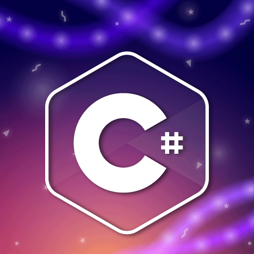

# Who am I?
My name is Devom Brahmbhatt and I’m the Head of Development of ImpactCode a 501(c) non-profit. On this page, you will find all of the code for all of my side projects.

### Languages that I use

