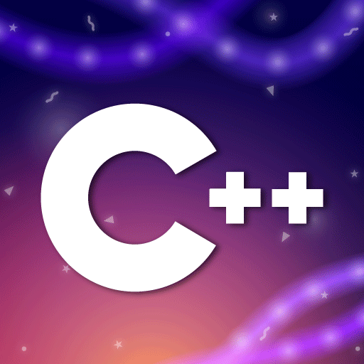

<h2>What's up </h2>
My name is Devom Brahmbhatt and I’m the Head of Development of ImpactCode a 501(c) non-profit. I started programming at a young age and from there, my love for this grew. On this page, you will find all of the code for all of my side projects.
  
<h3>Languages that I use<h3>

<!--

-->

<h3>Top Languages on GitHub</h3>

